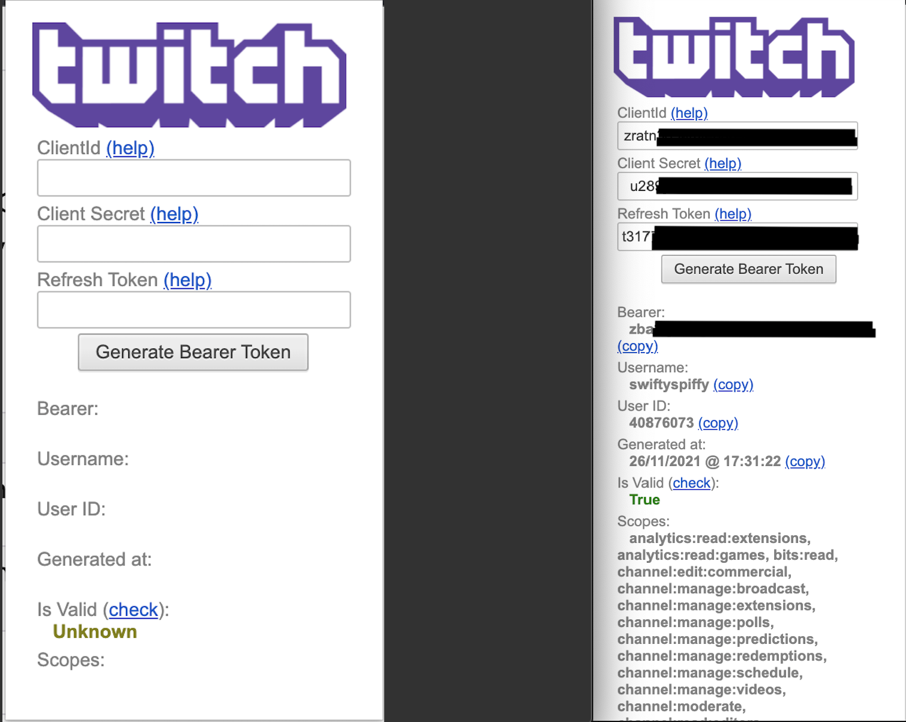
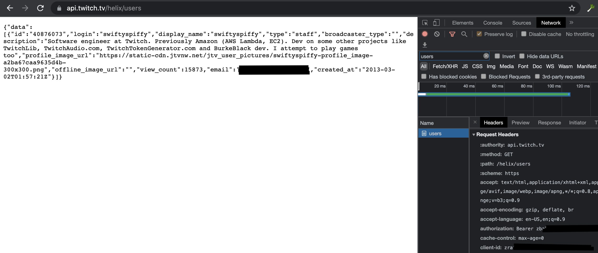

# Twitch-API-Injector
Chrome and Firefox extension for injecting Client ID and Authorization headers automatically into requests made against https://api.twitch.tv/helix/*

## Setup
Install the extension for either Chrome or Firefox below. Once installed, clicking on the extension will show a form with 3 text boxes. These need to be
populated in order for the extension to work. The steps to obtain each value are below:
### Client ID
To get a client id, you'll need to register an application on dev.twitch.tv. To do that, login to [dev.twitch.tv](https://dev.twitch.tv) with your Twitch
account. Create a new application [here](https://dev.twitch.tv/console/apps/create). Once created, the client id should be on the Manage Application for
your newly created application.

### Client Secret
Open your previously created application on dev.twitch.tv, open the manage page for your application, and click on the 'New Secret' button. A new secret
will appear on this page.

### Refresh Token
To generate a refresh token, you can either follow the Twitch authentication documentation or use a third party service.
#### Twitch Authentication Documentation
1. Documentation: https://dev.twitch.tv/docs/authentication#getting-tokens
2. If done correctly, you will get a JSON response that includes an access token and a refresh token. Copy the refresh token and paste it in to the Refresh Token text box in the extension.

#### Third Party Service
1. Open the management page for your TwitchDev application.
2. Add a redirect url of `https://twitchtokengenerator.com`
3. Head over to [TwitchTokenGenerator.com](https://twitchtokengenerator.com) (ignore the popup)
4. Under the `Use My Client Secret and Client ID` section, add your `Client Secret` and `Client ID`.
5. Select the scopes you're interested in.
6. Click the generate button. This will return 3 values in the `Generated Tokens` section: `Access Token`, `Refresh Token`, and `Client ID`. `Client ID` should match the one you previously made. Paste the `Refresh Token` into the extensions Refresh Token text box.

### Generate and Header Injection
Click the `Generate Bearer Token` button. If the textbox values were correctly, the extension should generate a Bearer token, as well as show information about the token like the username/id associated, and the generation time and scopes associated. 

Going forward, this bearer token will be used in requests made to the Twitch API (`https://api.twitch.tv/helix/*`) in your browser. If the token expires, you can click the button to generate a new one. Every time you open the extension form, a request is sent to verify the validity of the current token.

## Screenshots
Form UI:

Twitch Users call with no parameters (ie credentials user):

Twitch Users call with parameters:

## Chrome/Firefox Links
- Chrome: https://chrome.google.com/webstore/detail/twitch-api-injector/dkkaeileenafgjaebkckcldgmjbidbbi
- Firefox: https://addons.mozilla.org/en-US/firefox/addon/twitch-api-injector/

## Credits
[@3v](https://twitter.com/3ventic): Had the original idea, Chrome extension was pulled due to an attempt to remove unnecessary permissions, Chrome requiring additional effort, and the Chrome extension getting abandoned. Firefox extension can be found [here](https://addons.mozilla.org/en-US/firefox/addon/twitch-client-id-injector/).
[@Syzuna_](https://twitter.com/Syzuna_): Tested the extension for me :)